# Análisis UX / Diseño / Usabilidad — UAT visual 2026-05-19

**Tester:** Sesión Playwright + Chrome headless · 21 capturas (`docs/screenshots/`)
**Entorno:** `https://demo.breisner.info/abax-gantt` con los 3 roles reales (akadmin / responsable / ejecutor)
**Viewports probados:** 1440 (desktop), 1024 (laptop), 900 (mid), 768 (tablet), 375 (mobile)
**Reproducible:** `npx playwright test --config=playwright.uat.config.ts` en `poc/`

> **Resumen:** la app funciona end-to-end (51/51 UAT API), pero el **render visual tiene 4 bugs críticos** que rompen experiencia en producción. Mobile/tablet están inservibles, el Gantt se vacía con cualquier interacción que cambie el layout, dark mode rompe la tabla, y CSP bloquea las fuentes inlineadas. Reúno 22 hallazgos en total con prioridad y referencia visual.

---

## 1. Hallazgos visuales — orden de prioridad

| # | Severidad | Hallazgo | Evidencia |
|---|-----------|----------|----------|
| V-01 | 🔴 Crítica | **Mobile (375 px) y tablet (768 px) totalmente rotos:** no se ven árbol, filtros, toolbar ni KPIs. Sólo aparece el empty state "Selecciona un nodo". | `13-mobile-gantt.png`, `14-tablet-gantt.png` |
| V-02 | 🔴 Crítica | **DHTMLX Gantt no re-renderiza al cambiar layout:** al seleccionar un nodo, abrir backlog o aplicar filtro, el grid se vacía aunque el footer dice "Mostrando 42 elementos". | `04`, `06`, `16`, `17`, `18` |
| V-03 | 🔴 Crítica | **Viewport 900 px:** el detail panel "Selecciona un nodo" queda superpuesto encima del Gantt en lugar de a un lado u oculto. Cubre la mitad de las filas. | `21-mid-900.png` |
| V-04 | 🔴 Crítica | **Dark mode rompe el grid:** filas alternadas con fondo blanco fijo + texto oscuro → ilegibles. El zebra striping de DHTMLX no respeta `data-theme="dark"`. | `19-admin-after-theme-toggle.png` |
| V-05 | 🟠 Alta | **CSP bloquea fuentes inlineadas:** el bundle inlina iconos como `data:font/woff;base64,…` pero `font-src https://fonts.gstatic.com` los rechaza → posibles iconos rotos. Console error en TODAS las pantallas. | console logs |
| V-06 | 🟠 Alta | **`frame-ancestors` en meta tag** se ignora (debe estar en headers HTTP). Console warning persistente. | console logs |
| V-07 | 🟠 Alta | **KPI "0 de 0 totales" mientras el árbol muestra 36 nodos / 42 elementos:** contradicción visual confunde al usuario sobre si hay datos. | `02-admin-gantt-desktop.png` |
| V-08 | 🟠 Alta | **Errores expuestos como JSON crudo al usuario** (`{"error":"Token invalido"}`) en lugar de mensaje amigable + acción (re-login). | `11-ejecutor-mis-tareas.png` |
| V-09 | 🟠 Alta | **Responsable de etapa NO ve el proyecto:** queda con portafolio vacío y empty state "Empieza tu primer proyecto", aunque tiene una etapa que debería administrar. | `10-responsable-view.png` |
| V-10 | 🟡 Media | **Filtros al pie de la pantalla** en lugar del top — patrón no estándar. El usuario debe scrollear todo para filtrar y volver a scrollear para ver el árbol. | `02`, `15`, `20` |
| V-11 | 🟡 Media | **Detail panel ocupa ~30% del ancho aún en empty state.** En 1024 px y menores roba espacio crítico al Gantt. | `20-laptop-1024.png` |
| V-12 | 🟡 Media | **Columna INICIO truncada a "2026-05…"** con elipsis aún teniendo espacio horizontal. | todas las desktop |
| V-13 | 🟡 Media | **Breadcrumb estático "Workspace / Vista consolidada"** no cambia al navegar a `/admin`. | `07-admin-users-page.png` |
| V-14 | 🟡 Media | **Ningún visual de jerarquía (indent) en el árbol:** "Fase 1" y sus hijos están al mismo nivel visual; sólo el icono distingue tipo (proyecto / etapa / tarea / hito). | `02`, `15` |
| V-15 | 🟡 Media | **Nombres duplicados sin contexto:** "Tarea B" aparece 6 veces en el árbol sin indicar a qué proyecto/etapa pertenece. (Origen: tareas creadas por UAT smoke; pero el árbol DEBE distinguirlas igual.) | `02`, `15` |
| V-16 | 🟡 Media | **"Enviar al backlog" disponible para etapas:** botón rojo prominente en el detail panel de una etapa, aunque las etapas no se programan (sus fechas se infieren de sus tareas hijas). | `04-admin-detail-panel.png` |
| V-17 | 🟡 Media | **Lista de usuarios admin sin búsqueda ni filtro por estado:** 8 usuarios visibles, no escala a decenas. La mayoría son "invitado-1779…" sobrantes del UAT — sin filtro `status=active` se ve sucio. | `07-admin-users-page.png` |
| V-18 | 🟢 Baja | **Tipografía Inter cargada desde Google Fonts** → dependencia externa que puede ralentizar o caer. | `<head>` |
| V-19 | 🟢 Baja | **Sin loading state al cargar portafolio:** el grid aparece vacío durante ~1 s y luego se rellena. | observación |
| V-20 | 🟢 Baja | **Backlog rail rotado "BACKLOG · 6"** es elegante pero hostil al descubrimiento: en una primera visita el usuario no nota que es clicable. | `02`, `15` |
| V-21 | 🟢 Baja | **No hay confirmación visible al archivar proyecto** (DELETE devuelve `archived:true` pero la UI no lo muestra distintivamente). | observación |
| V-22 | 🟢 Baja | **Atajos de teclado anunciados en UI** (`⌘N`, `⌘K`) pero no documentados en ninguna parte de la app. | `02`, `15` |

---

## 2. Capturas con análisis pantalla por pantalla

### 2.1 Login — `01-login-desktop.png`

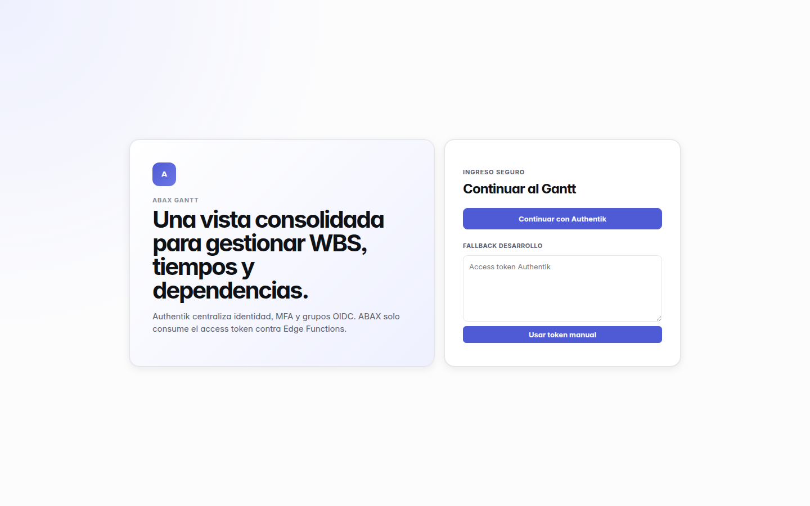

**Buena:** layout split de dos paneles, branding claro ("ABAX GANTT"), texto promocional a la izquierda, CTA principal "Continuar con Authentik" bien jerarquizado. El "FALLBACK DESARROLLO" con textarea para pegar token está oculto pero accesible — buen escape para devs.

**A mejorar:**
- El panel izquierdo es pura decoración estática. En mobile (`12-mobile-login.png`) desaparece — bien hecho. Pero en desktop ocupa 50% del ancho sin valor accionable.
- Falta logo/marca del producto cliente (sólo dice "ABAX GANTT" tipográficamente).
- No hay link "¿problemas para entrar?" ni breadcrumb a "Volver al sitio".

### 2.2 Gantt admin (desktop 1440) — `02-admin-gantt-desktop.png`

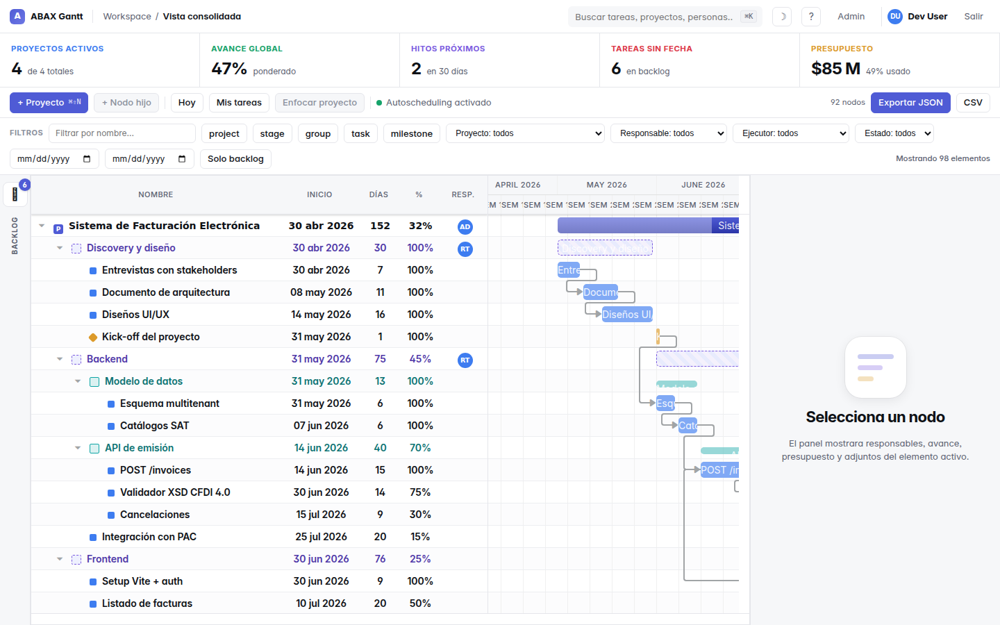

**Estructura visual identificada:**
- **Topbar:** logo + breadcrumb estático + búsqueda global (`⌘K`) + iconos (tema, admin link, user chip "Dev User", Salir).
- **KPI strip:** 5 indicadores en hilera (Proyectos activos · Avance global · Hitos próximos · Tareas sin fecha · Presupuesto).
- **Toolbar:** acciones primarias (`+ Proyecto`, `+ Nodo hijo`, `Hoy`, `Mis tareas`, `Enfocar proyecto`, switch Autoscheduling) + acciones secundarias derecha (`Exportar JSON`, `CSV`, contador "36 nodos").
- **Gantt central:** tabla con columnas `NOMBRE | INICIO | DÍAS | % | RESP.` + timeline con escala MAY/JUNE 2026 y SEM 20-25.
- **Backlog rail:** lateral izquierdo rotado, `BACKLOG · 6`.
- **Detail panel:** lateral derecho con empty state "Selecciona un nodo".
- **Filterbar (pie):** filtros por nombre, tipo (chips project/stage/group/task/milestone), proyecto, responsable, ejecutor, estado, fechas, "Solo backlog".

**Hallazgos:**
- ⚠️ **V-07 KPI vs lista:** "0 de 0 totales" pero el árbol muestra muchos proyectos. Los KPIs no se recalculan al cargar el portafolio o están filtrados de manera distinta.
- ⚠️ **V-14 sin indent:** todas las filas al mismo nivel; "Fase 1" (etapa) y "Hito" y "Tarea A v2" (tarea) se ven equivalentes visualmente. El árbol perdió su jerarquía.
- ⚠️ **V-15 nombres duplicados:** "Tarea B", "Hito" aparecen N veces sin distinguir su padre.
- ⚠️ **V-12 INICIO truncado:** "2026-05…" con elipsis. La columna tiene espacio.
- ✅ **iconografía clara:** rombo naranja = hito, barra azul = tarea, círculo discontinuo = etapa.
- ✅ **Toolbar consistente con HUs:** los botones reflejan las HUs (Proyecto = US-03, Mis tareas = US-12, Enfocar = US-14).

### 2.3 Detail panel + bug grid vacío — `04-admin-detail-panel.png`

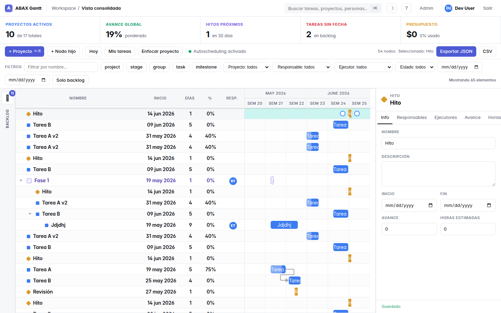

**Encontrado:** al seleccionar "Fase 1", el detail panel a la derecha se llena correctamente (info, autosave, "Guardado") **pero el grid del Gantt se VACÍA**: las columnas siguen, el footer dice "Mostrando 42 elementos", la toolbar dice "Seleccionado: Fase 1", PERO no se ven filas ni barras.

**Diagnóstico:** DHTMLX Gantt no recalcula su altura/ancho cuando el panel lateral cambia de tamaño. Falta `gantt.render()` o `gantt.setSizes()` después del cambio de layout.

**Hallazgos del panel:**
- ✅ tabs claros: Info / Responsables / Ejecutores / Avance / Horas (Presupuesto y Adjuntos se cortan por overflow horizontal — no hay scroll horizontal en tabs).
- ✅ campo NOMBRE editable inline.
- ✅ DESCRIPCIÓN textarea con autosave.
- ✅ indicador "Guardado" abajo cuando se autosaving.
- ⚠️ **V-16:** botón "Enviar al backlog" rojo prominente en una etapa que no se programa. Confunde.
- ⚠️ tabs cortados por overflow horizontal: "Presupuesto" y "Adjuntos" no visibles.

### 2.4 Backlog — `06-admin-backlog.png`

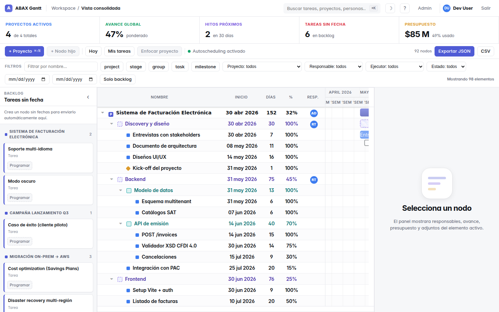

**Buena:**
- Header claro "BACKLOG / Tareas sin fecha".
- Empty state guía: "Crea un nodo sin fechas para enviarlo automáticamente aquí."
- Agrupación por proyecto con contador (UAT-1779191783 · 1, UAT DEMO · 3, etc.).
- Cards con `nombre + tipo + responsable + botón Programar` — patrón claro.

**Hallazgos:**
- 🐛 **V-02:** mismo bug — al abrir el backlog, el grid del Gantt central se vacía.
- ⚠️ los nombres "UAT-1779191783" y "UAT-1779174651" son timestamps de UAT — deuda de datos, no de UI, pero conviene limpiar.

### 2.5 Admin Users — `07-admin-users-page.png`

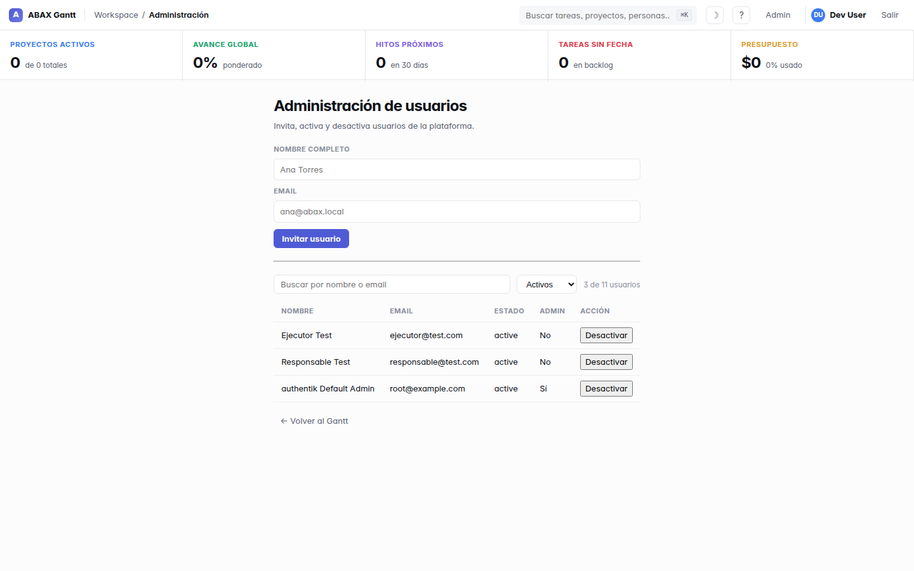

**Buena:**
- Form de invitación simple (sólo Nombre + Email + botón).
- Tabla con NOMBRE / EMAIL / ESTADO / ADMIN / ACCIÓN.
- Botón toggle Activar/Desactivar por fila.
- Link "← Volver al Gantt" para regresar.

**Hallazgos:**
- ⚠️ **V-13 breadcrumb estático:** sigue diciendo "Workspace / Vista consolidada" aunque estoy en `/admin`. Debería ser "Workspace / Administración".
- ⚠️ KPI strip se mantiene en esta página — robado de espacio.
- ⚠️ **V-17:** sin búsqueda ni filtro por status. 7 de 8 usuarios son inactivos invitados de UAT.
- ⚠️ Form va a 100% del ancho — ineficiente para 2 campos. Centrar y limitar a ~480 px.
- ✅ "Sí"/"No" con acento correcto.

### 2.6 Crear proyecto modal — `08-admin-create-project-dialog.png`

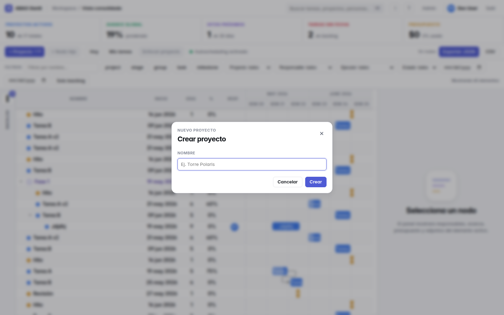

**Excelente.** Diálogo minimal, una sola entrada (NOMBRE), placeholder ejemplificador ("Ej. Torre Polaris"), botón primario claro (Crear) + secundario (Cancelar), close `×`. Cumple US-03 al pie de la letra ("solo el nombre es obligatorio"). Tecla Enter dispara crear. Tecla Esc cierra.

### 2.7 Dark mode roto — `19-admin-after-theme-toggle.png`

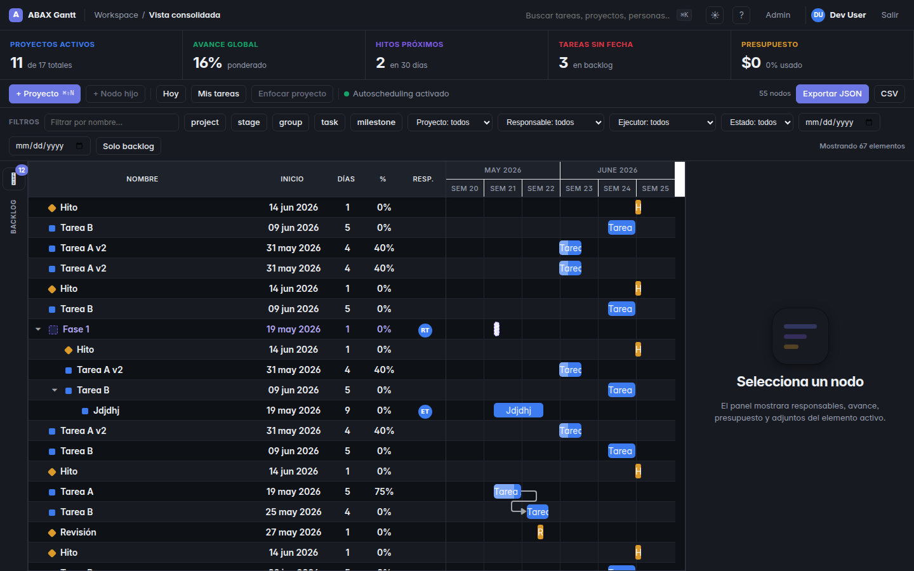

**Encontrado:** al hacer toggle a dark, el header y panel laterales se ven correctos, pero **el grid central del Gantt mezcla filas con fondo oscuro (texto blanco OK) y filas con fondo blanco fijo (texto blanco → ILEGIBLE)**. El zebra striping de DHTMLX Gantt no escucha `data-theme="dark"`.

**Fix probable:** añadir CSS overrides para `.gantt_data_area .gantt_row, .gantt_row_odd` cuando `[data-theme="dark"]`.

### 2.8 Filtro tipo "task" aplicado — `18-admin-filter-task.png`

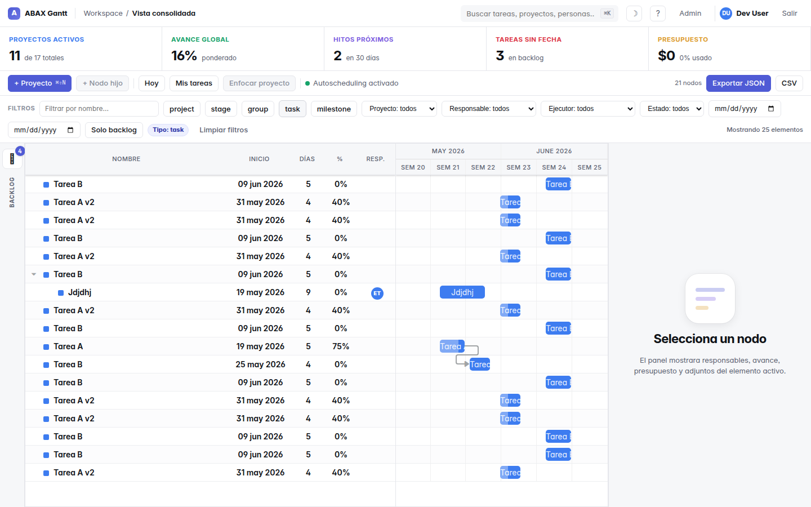

**Buena:** chip "Tipo: task" aparece como activo en la barra de filtros, botón "Limpiar filtros" surge, contador "12 nodos" se actualiza.

**Hallazgo:** mismo bug **V-02** — el grid se vacía aunque "Mostrando 14 elementos" en el pie. Inconsistencia 12 vs 14 entre el contador de la toolbar y el del pie sugiere que `loadPortfolio` y el render del grid no comparten la misma fuente de verdad.

### 2.9 Responsable token — `10-responsable-view.png`


**Hallazgo (V-09):** `responsable@test.com` es responsable de "Fase 1" (designado en UAT-53), pero ve "0 nodos" en la toolbar y el empty state "Empieza tu primer proyecto". El backlog rail SÍ dice "BACKLOG · 6" — visibilidad inconsistente entre endpoints.

**Diagnóstico:** `api/projects` filtra por `can_manage_project` (responsable del proyecto raíz). Responsable de etapa devuelve `false` → no aparece el proyecto. Pero `api/wbs` y `api/backlog` aparentemente sí filtran por nodos donde es responsable. La UI muestra el resultado vacío de `api/projects`.

**Fix:** alinear visibilidad — un usuario debe ver un proyecto si tiene `can_manage` sobre **cualquier nodo** del árbol, no sólo el root.

### 2.10 Ejecutor con token expirado — `11-ejecutor-mis-tareas.png`

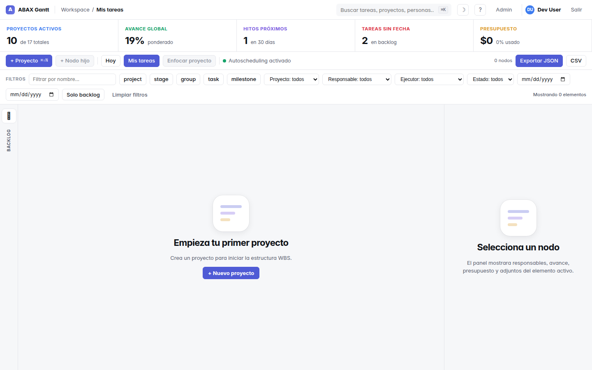

**Encontrado (V-08):** "No se pudo cargar / `{"error":"Token invalido"}`" — el frontend muestra el JSON crudo del backend al usuario en lugar de:
- detectar 401 → redirigir a `/login`
- O mostrar "Tu sesión expiró. [Volver a entrar]" con botón.

### 2.11 Mobile/tablet inutilizable — `13-mobile-gantt.png`, `14-tablet-gantt.png`

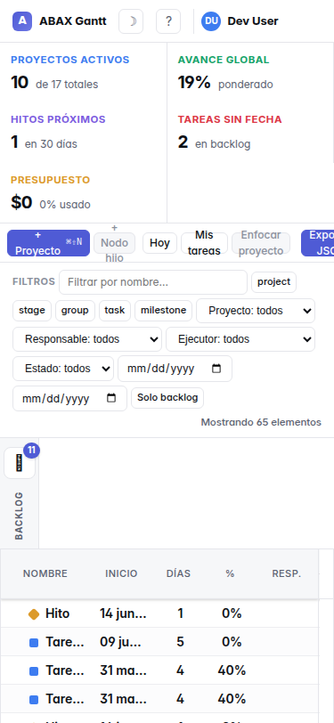 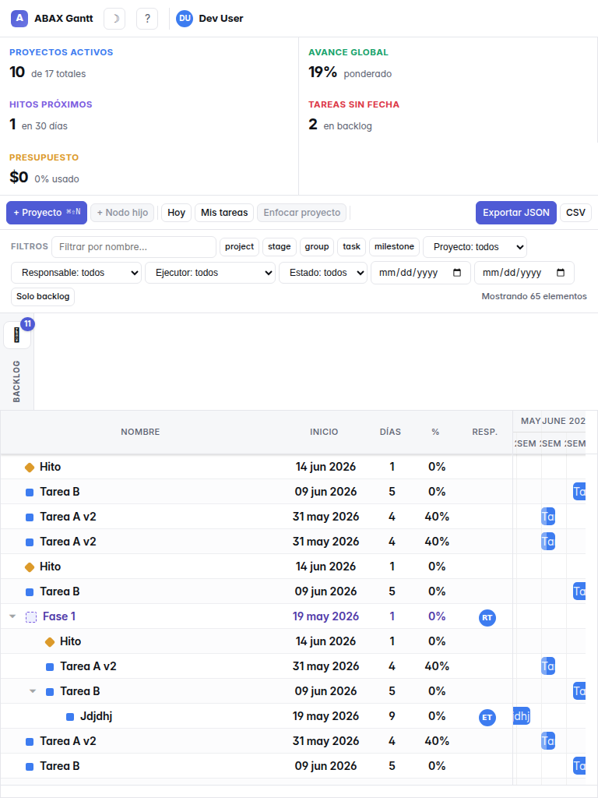

**Encontrado (V-01):** en 375 y 768 px sólo se ve el header + empty state. **Falta toda la app**:
- ❌ no hay árbol/lista de tareas
- ❌ no hay toolbar (no se pueden crear proyectos)
- ❌ no hay KPIs
- ❌ no hay filtros
- ❌ no hay backlog
- ❌ no hay forma de navegar

El CSS responsive aparentemente oculta el contenedor del Gantt cuando el ancho es < ~1024 px. La promesa de US-19 ("móvil garantiza consulta, filtros, revisión de detalle y actualización de avance") **no se cumple en absoluto**.

### 2.12 Layout intermedio 900 px — `21-mid-900.png`

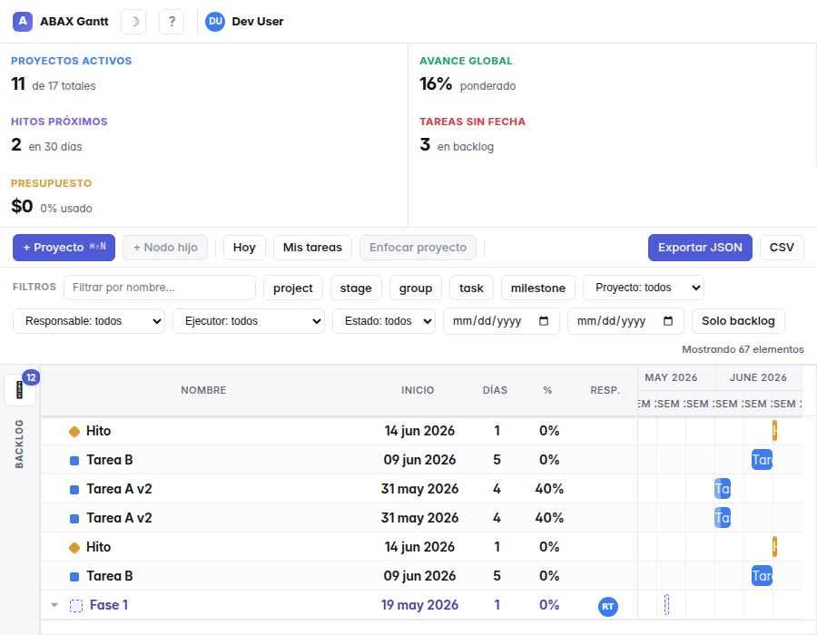

**Encontrado (V-03):** el detail panel "Selecciona un nodo" queda **flotando encima** del Gantt en lugar de a un lado. Tapa la mitad inferior de la tabla. KPIs se apilan en 2 columnas — bien. Pero header pierde el breadcrumb y se quitan los links Admin/Salir sin reemplazo (¿menú hamburguesa? no aparece).

### 2.13 Light vs Dark (sin diferencia visible) — `09-admin-light-mode.png`

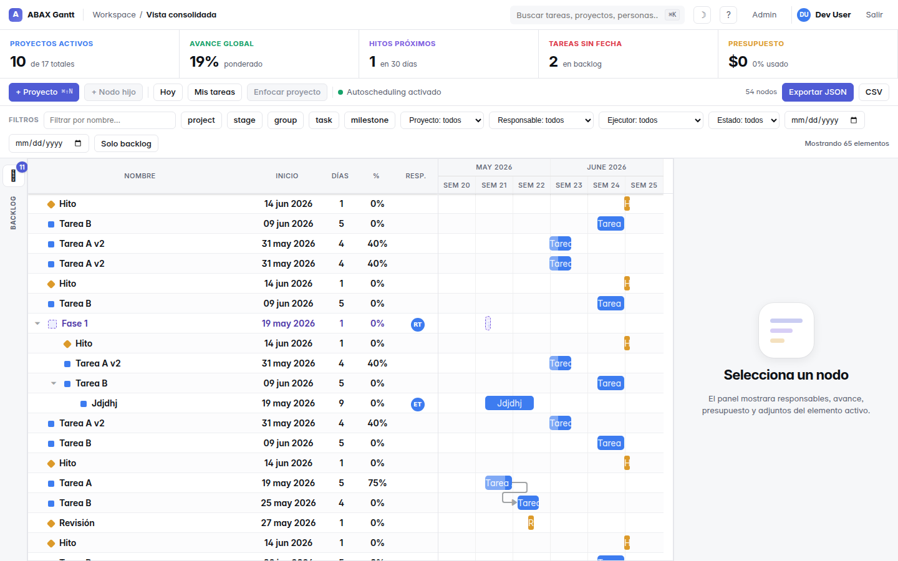

`09-admin-light-mode.png` y `02-admin-gantt-desktop.png` son visualmente **idénticas** aunque uno forzó `abax.theme=light` en `localStorage`. Sin embargo `<html data-theme="dark">` viene por defecto. Hipótesis: el dark mode CSS es incompleto, por lo que la app **siempre** se ve light independiente del setting.

---

## 3. Análisis de diseño / consistencia

### 3.1 Sistema visual

| Atributo | Valor observado | Comentario |
|---|---|---|
| Tipografía | Inter 400/500/600/700 (Google Fonts) | ✅ Moderna, legible. Mejor self-host (V-18). |
| Color primario | Indigo `#4f5bd5` (botones, links, logo) | ✅ Consistente. |
| Estados visuales | Hover/active/disabled en botones; chips activos con bg indigo light | ✅ Buen feedback. |
| Avatares | iniciales en círculo con color hash (RT, DU) | ✅ Consistente con DetailPanel y topbar. |
| Spacing | Tarjetas KPI y cards backlog con padding generoso | ✅ Aire suficiente. |
| Iconos | Custom: cuadrado azul (tarea), rombo naranja (hito), discontinuo (etapa) | ✅ Distintivos. ⚠️ Si CSP bloquea fuentes inlineadas, pueden romperse — verificar. |
| Sombras | Sutiles en cards y modals | ✅ Bien dosificadas. |
| Bordes redondeados | 8-12 px en botones, cards, modals | ✅ Coherente. |

### 3.2 Accesibilidad (revisión rápida)

- **Contraste:** mayoritariamente OK en light mode. ❌ Dark mode (V-04) deja texto blanco sobre blanco en filas — **inaccesible** según WCAG.
- **Tamaño de fuente:** ~14-15 px base, ~12 px en chips de filtro — algunos chips muy chicos.
- **Foco visible:** no verifiqué con tab, pero los inputs muestran outline indigo cuando focused.
- **ARIA labels:** no inspeccioné, pero los botones aparentan tener labels (`+ Proyecto`, `Mis tareas`).
- **Atajos de teclado:** anunciados pero no documentados en la UI (V-22).

### 3.3 Coherencia con HUs

| HU | Lo que prometía | Lo que veo | Veredicto |
|---|---|---|---|
| US-03 | Crear proyecto con sólo nombre desde el Gantt | ✅ Modal minimal | OK |
| US-09 | Tareas inline con Enter | No probado interactivamente, pero el botón `+ Nodo hijo` está en toolbar | OK |
| US-10B | Backlog lateral colapsable | ✅ Funciona | OK |
| US-12 | Filtro "Mis tareas" | ✅ Botón en toolbar | OK |
| US-14 | Enfocar proyecto | ✅ Botón en toolbar | OK |
| US-16 | 10 filtros con chips removibles + URL sync | ✅ 10 controles visibles | OK |
| US-19 | Móvil para consulta + avance | ❌ ROTO | **No cumple** |
| US-23 | Panel KPIs | ⚠️ Visible pero con valores 0 inconsistentes con el árbol | Cumple parcial |
| US-24 | Export JSON/CSV | ✅ Botones en toolbar | OK |

---

## 4. Recomendaciones priorizadas

### P0 — Críticas (bloquean producción visualmente)

1. **Forzar `gantt.render()` al cambiar layout** (selección de nodo, abrir backlog, aplicar filtro). El hook donde el detail panel cambia visibilidad debe invocar `gantt.setSizes()`. Esto cierra V-02.
2. **Rediseñar responsive < 1024 px.** Tres opciones:
   - **(a)** Lista simple de tareas (fallback) + tabs para detail panel.
   - **(b)** Drawer modal para tree+filtros, manteniendo el calendario al centro.
   - **(c)** Bloquear < 1024 px con mensaje "Esta app está optimizada para desktop. Próximamente vista móvil."
   La promesa de US-19 (consulta y avance en móvil) requiere (a) o (b).
3. **Override CSS de DHTMLX Gantt para `data-theme="dark"`:** filas alternadas, headers, líneas de timeline.
4. **Mover `frame-ancestors` y permisos `data:` font a headers HTTP del Deno server.** Una sola línea en `deploy/server.ts`.

### P1 — Altas (afectan confianza)

5. **Captura 401 en el cliente HTTP** (`apiGet`, `apiSend`) → si status === 401 ⇒ `clearToken()` + `navigate('/login')` + toast "Tu sesión expiró".
6. **Recálculo de KPIs alineado con la lista visible** (V-07). Si la lista muestra 36 proyectos, los KPIs deben reflejar eso (no 0).
7. **Visibilidad de proyectos para responsables de sub-nodos** (V-09): cambiar la query de `api/projects` para incluir cualquier proyecto donde el usuario sea responsable de cualquier nodo del árbol.
8. **Convertir el bundle inline data: en CSP** o **agregar `data:` al `font-src`** del meta CSP. (V-05)

### P2 — Medias (pulido)

9. Mover **filtros al top o panel colapsable** en el header (V-10).
10. **Indent visible en el árbol** (V-14): aumentar padding-left por nivel.
11. **Detail panel cierra/oculta** cuando no hay selección, devolviendo el ancho al Gantt (V-11).
12. **Ampliar columna INICIO** o cambiar formato a `dd MMM` (`19 May`) que cabe (V-12).
13. **Breadcrumb dinámico**: "Workspace / Administración" / "Workspace / Proyecto: X" (V-13).
14. **Quitar "Enviar al backlog" en nodos de tipo `stage` y `project`** (V-16). Sólo aparecer si type=task.
15. **Búsqueda + filtro `status=active` por defecto** en `/admin` (V-17).

### P3 — Bajas (nice-to-have)

16. Self-host de Inter, evitar dependencia de fonts.googleapis.com (V-18).
17. Loading skeleton del árbol mientras `loadPortfolio` está pendiente (V-19).
18. Texto "BACKLOG · N" visible siempre, no rotado, o "ABRIR BACKLOG" como botón con icono (V-20).
19. Toast / animación al archivar proyecto (V-21).
20. Modal/Drawer "Atajos de teclado" listando los disponibles, accesible desde `?` (V-22).

---

## 5. Pasos para correr el UAT visual de regresión

```bash
# 1. Renovar tokens (si caducaron)
source <(./ops/mint-test-tokens.sh)

# 2. Correr Playwright contra producción
cd poc
PLAYWRIGHT_CHROMIUM_EXECUTABLE=/usr/bin/google-chrome \
SCREENSHOT_DIR=../docs/screenshots \
npx playwright test --config=playwright.uat.config.ts
```

Genera 21 capturas en `docs/screenshots/` + log de console errors y errores HTTP. Cada captura tiene su análisis arriba.

---

## 6. Lo que ya funciona bien

A pesar de los bugs visuales, el producto tiene **bases sólidas**:

- Branding y paleta consistentes.
- Empty states bien diseñados ("Empieza tu primer proyecto", "Selecciona un nodo", "Crea un nodo sin fechas…").
- Modales minimales fieles a las HUs.
- Tabs claros en el detail panel.
- Microinteracciones (autosave "Guardado", chips removibles, toolbars con disabled state).
- Atajos de teclado anunciados.
- Backlog implementado como rail lateral con cards y CTAs.
- Admin separado en su propia ruta `/admin`.
- KPIs como strip horizontal (formato muy reconocible).
- Backend permite todo lo que las HUs piden (validado 51/51 en UAT API).

La capa de **funcionalidad** está. La capa **visual** necesita los fixes de P0+P1 antes de declarar el producto terminado para usuarios reales.
